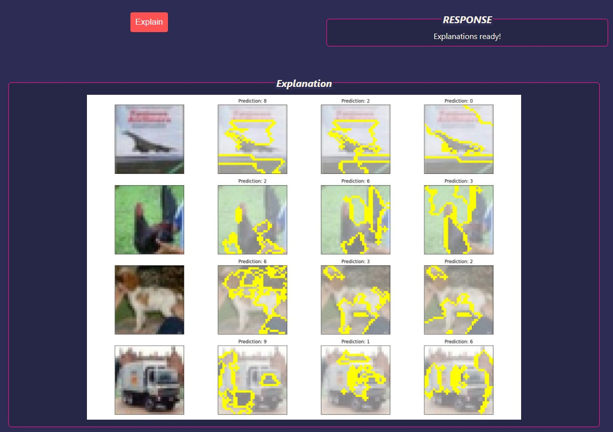

This repository contains the project for the post `Explainable AI Framework Comparison Part 3: Using LIME in a React Application` ([link](https://kedion.medium.com/explainable-ai-framework-comparison-106c783554a)) on the Kedion blog on Medium.

## Clone Project

Clone the project:

`git clone https://github.com/tavetisyan95/lime_web_app.git`


## Set the `api_url`

In the directory `app/lime_web_app/src/` inside `config.js`, edit the API URL, if necessary:

```
export const config = {
  api_url: "localhost",
  api_port: 5000,
  http_server_port: 8080,
  api_explain_endpoint: "/explain/",
  api_model_upload_endpoint: "/upload-model/",
  api_image_upload_endpoint: "/upload-images/"
};

```

Don't put any http or backslashes in the api_url.

NOTE: If you want to use different ports for the API or http-server, set them here.


## Install Dependencies and Start Web Servers

Run the following in terminal:

`bash start.sh`

NOTE: Make sure that ports 3000, 5000, and 8080 are publicly available and unused by other processes. If not, either free them up or use other ports.

The app should launch in your web browser. If it doesn't, navigate to http://localhost:3000.

The app will have been fully launched once its webpage opens in the browser.


## 1. Uploading model weights and architecture

Once the app is running, the first thing to do is to upload your TensorFlow Keras model weights and architecture. 


Test weights and architecture are provided in the directory `/models` for two models - one trained on MNIST digits and the other trained on CIFAR10.

To upload model weights and architecture, click on the respective `UPLOAD` button and select the correct file under `/models`. Make sure to select the correct combination of weights and architecture - wrong combinations will not work because the model input shapes are different.

Model weights are expected in `.h5` format, while the architecture is expected in `.json` format.

To get model weights, call the method `.save` of your `Model` or `Sequential` object.

To get the model architecture, call the method `.to_json` of your `Model` or `Sequential` object.

After you select the files, click `Upload model`. If the operation is successful, you will see `Model uploaded!` under `RESPONSE`.

## 2. Uploading images

Next, upload images.


Test images are provided for each of the classes of MNIST digits and CIFAR10. You can find these under `images/mnist` and `images/cifar` respectively.

Click `UPLOAD` under `Images`, navigate to the folder that corresponds to the model you uploaded, and select the images for upload.

You should ideally upload images for EVERY available class. But this isn't necessary if you want to just explain a specific class.

The app expects uint8-encoded JPEG images. The channel dimension should be -1. The pixel values in the images should range from 0 to 255 - they should NOT be normalized.

The provided test images were saved using the following piece of Python code:

```
# Writing images to disk
for i in range(len(images)):    
    tf.io.write_file(f"digit_{i}.jpg", tf.image.encode_jpeg(images[i]))    
```

After you select images, click `Upload images`. If the operation is successful, you will see `Images uploaded!` under `RESPONSE`.

## 3. Selecting a segmentation algorithm and adjusting parameters

Next, you can select a segmentation algorithm to generate explanations with. You can choose between `quickshift`, `felzenszwalb`, and `slic` - all three algorithms supported by LIME.


Select an algorithm by using the dropdown list under `Segmenter`. Then, adjust the available parameters if you want. The default parameters in the app produce decent explanations for both CIFAR10 and MNIST images.

To find out more about the meaning of the available parameters, consult the [scikit-image docs](https://scikit-image.org/docs/stable/api/skimage.segmentation.html).

## 3. Adjusting explanation parameters


As the last step, you can adjust the parameters for the explanation. Here are a few things to keep in mind here:

- `Image indices` determines which of the images you uploaded the app will generate explanations for. If you type `0, 1, 3`, you will get explanations for the images under the indices 0, 1, and 3.
- `Top labels` determines the number of predictions for the uploaded images that LIME will store. If you type `3`, LIME will store the top 3 predictions with the highest probabilities. `Top labels` should be equal to or less than the total number of classes that your model was trained to predict.
- `Top predictions` determines the number of predictions from the stored `Top labels` that you want to explain. If you type `3`, LIME will generate explanations for the top 3 predictions. `Top predictions` should be equal to or less than `Top labels`.
- `Labels to explain` determines which labels LIME should generate explanations for. If `None`, LIME will generate explanations with respect to the stored `Top labels`. If NOT `None`, LIME will generate explanations with respect to the provided values. If you wanted to generate explanations with respect to the classes 0, 3, and 8, you would pass `0, 3, 8` to `Labels to explain`. Note that if `Labels to explain` is NOT `None`, there should only be ONE value under `Image indices`.
- `Number of samples` determines the size of the neighborhood that LIME will generate to explain images. Higher values might improve explanation clarity but will increase the amount of time necessary to generate explanations.

After you've adjusted the parameters, click `Explain`. Once explanations are generated, you will see `Explanations ready!` under `RESPONSE`, as well as generated explanations under `Explanation`.



You can save the explanation by right-clicking on it and selecting `Save image as` or `Copy image`.

## LIMITATIONS OF THE APP

In its current implementation, the app has some notable limitations, including:

- No error messages pop up on the webpage if something goes wrong. The only source of information about errors is the app's terminal.
- The app only supports TF/Keras models, and it only supports JPEG images.
- When `Labels to explain` is NOT `None`, the app can only generate explanations for ONE image index.
- The only preprocessing step done on uploaded images is normalization by dividing the pixel values by 255.0.
- Invalid inputs for parameters aren't handled. No error messages are shown in the web browser. The only way to know that something has gone wrong is through terminal logs.
- Not all parameters of the supported segmentation algorithms were included in the app.

## Starting in Docker
```docker-compose -f docker-compose.yaml up -d --build```
